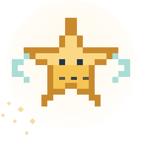

<div align="center">


<br/>

<a href="https://linkedin.com/in/carloseduardo2003" target="_blank">
  
</a>
<a href="https://www.instagram.com/_carlws_/" target="_blank">
  
</a>
<a href="https://ceportfolio.vercel.app" target="_blank">
  
</a>

</div>

<br/>

<div align="center"></div>

<br/>

## Sobre mim

<table>
<tr>
<td width="150" align="center" valign="top">



</td>
<td valign="top">

Sou desenvolvedor com atuação ampla, mas o foco principal é **front-end** — interfaces bem construídas, com atenção a performance, acessibilidade e consistência visual. Atualmente estou expandindo para **Inteligência Artificial**, unindo experiência de produto com as ferramentas dessa nova fase da área.

Baseado em Curitiba, Brasil 🇧🇷. Sigo um princípio simples: **código bonito é aquele que respeita quem lê e quem usa.**

</td>
</tr>
</table>

**O que eu manjo bem**
- **Construção de interfaces:** HTML, CSS e JS bem estruturados, sem gambiarra.
- **Design de experiência:** microinterações, acessibilidade e consistência visual.
- **Em desenvolvimento:** Inteligência Artificial aplicada a produto — meu próximo grande foco.

<br/>

<div align="center"></div>

<br/>

## 🛠️ Stack

<table>
<tr>
<td align="center" width="50%">

**⚡ Interfaces Reativas**


</td>
<td align="center" width="50%">

**💧 Fluidez & Design**


</td>
</tr>
<tr>
<td align="center" width="50%">

**🌿 Sabedoria & IA**


</td>
<td align="center" width="50%">

**⛰️ Fundação & Infra**


</td>
</tr>
</table>

<br/>

<div align="center"></div>

<br/>

## 📊 Estatísticas

> ⚠️ Troque `TENSHI-USERNAME` pelo seu usuário real do GitHub em **todos** os links abaixo — sem isso, os cards não têm dados para exibir e aparecem quebrados.

<div align="center">


<br/>


</div>

<br/>

## 📌 Projetos em destaque

<div align="center">


</div>

<br/>

<div align="center"></div>

<br/>

## 📈 Trilha de Contribuições

<div align="center">

</div>

<details>
<summary><b>⚙️ Como ativar este grafo (configuração única, ~2 minutos)</b></summary>
<br/>

Esse gráfico é gerado por uma **GitHub Action self-hosted** — ela roda dentro do seu próprio repositório, então não depende de nenhum servidor externo (diferente do serviço antigo, que estava fora do ar). Para ativar:

1. No seu repositório `TENSHI-USERNAME/TENSHI-USERNAME`, crie o arquivo `.github/workflows/dragon.yml` com o conteúdo abaixo.
2. Vá em **Settings → Actions → General → Workflow permissions** e marque **"Read and write permissions"**.
3. Rode o workflow uma vez manualmente na aba **Actions** (botão *Run workflow*).
4. Pronto — a partir daí ele atualiza sozinho todo dia.

```yaml
name: dragon-graph

on:
  schedule:
    - cron: "0 3 * * *"
  workflow_dispatch:

jobs:
  generate:
    permissions:
      contents: write
    runs-on: ubuntu-latest
    steps:
      - uses: actions/checkout@v4

      - name: Gerar grafo de contribuições
        uses: Platane/snk/svg-only@v3
        with:
          github_user_name: ${{ github.repository_owner }}
          outputs: |
            dist/dragon.svg
            dist/dragon-dark.svg?palette=github-dark&color_snake=%23F4D58D
        env:
          GITHUB_TOKEN: ${{ secrets.GITHUB_TOKEN }}

      - name: Publicar no branch output
        uses: stefanzweifel/git-auto-commit-action@v5
        with:
          branch: output
          commit_message: "Atualiza grafo de contribuições 🐉"
          file_pattern: "dist/*.svg"
          create_branch: true
          push_options: "--force"
```

</details>

<br/>

<div align="center">

### *"Que as estrelas iluminem seu caminho."*

<sub>Perfil atualizado com carinho ✦ obrigado pela visita</sub>


</div>
