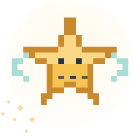

  

&nbsp;

&nbsp;

&nbsp;

 

 

## Sobre mim

<table>
<tr>
<td width="150" align="center" valign="middle">

</td>

<td valign="middle">

Desenvolvedor graduado em **Análise e Desenvolvimento de Sistemas (ADS)** e cursando pós-graduação em **AI Scientist**, focado em **desenvolvimento front-end** com **Next.js, React e TypeScript**.

Construo interfaces modernas, acessíveis e responsivas, priorizando a estabilidade do código através de testes automatizados com **Vitest e Playwright E2E**. No backend, desenvolvo APIs e microsserviços com **Python e FastAPI** para integrar modelos de IA a aplicações reais.

</td>
</tr>
</table>

 

✧ &nbsp; · &nbsp; ✦ &nbsp; · &nbsp; ✧

### ✦ Áreas de atuação ✦

 

**⚡ Desenvolvimento Front-end**  
Construção de interfaces modernas, acessíveis e responsivas  
**Next.js 15 · React 19 · TypeScript · Tailwind CSS v4**

 

✦　✧　⋆　✦　✧　⋆　✦

 

**🧪 Confiabilidade & Testes**  
Garantia de estabilidade e prevenção de regressões através de testes automatizados  
**Testes Unitários & Integração · Vitest · Playwright E2E**

 

✦　⋆　✧　⋆　✦

 

**🌿 Backend & Inteligência Artificial**  
Desenvolvimento de microsserviços e integração de modelos inteligentes  
**Python 3.12 · FastAPI · APIs de IA · Contratos Tipados**

 

✧　·　✦　·　✧　·　✦　·　✧

 

 

## 🛠️ Stack & Ferramental

<table width="100%">
<tr>
<td align="center" width="50%" valign="top">

### ⚡ Interfaces Reativas

 

 

</td>

<td align="center" width="50%" valign="top">

### 🧪 Confiabilidade & QA

 

 

</td>
</tr>

<tr>
<td align="center" width="50%" valign="top">

### 🌿 Backend & IA

 

 

</td>

<td align="center" width="50%" valign="top">

### ⛰️ Fundação & Infra

 

 

</td>
</tr>
</table>

 

 

## 📊 Estatísticas

<table width="100%">
<tr>

<td align="center" valign="middle" width="50%">

</td>

<td align="center" valign="middle" width="50%">

</td>

</tr>
</table>

 

## 📌 Projetos em Destaque

<table width="100%" border="0">
<tr>

<td align="center" width="50%" valign="top">

╔══════════════════════════════════════╗ 
### ✦ Lumen Studio

*Design Tokens & Color System Studio* 
Aplicação para criação e gestão de paletas acessíveis, com testes unitários e E2E

 

 

  

&nbsp;

  

╚══════════════════════════════════════╝

</td>

<td align="center" width="50%" valign="top">

╔══════════════════════════════════════╗ 
### ✦ Portfolio & Lab

*Front-end & Component Lab* 
Portfólio pessoal explorando Server Components, performance e pontuação máxima no Lighthouse

 

 

  

&nbsp;

  

╚══════════════════════════════════════╝

</td>

</tr>
</table>

 

 

## 📈 Trilha de Contribuições

 

### *"Que as estrelas iluminem seu caminho."*

Perfil mantido com dedicação e identidade ✦ obrigado pela visita

