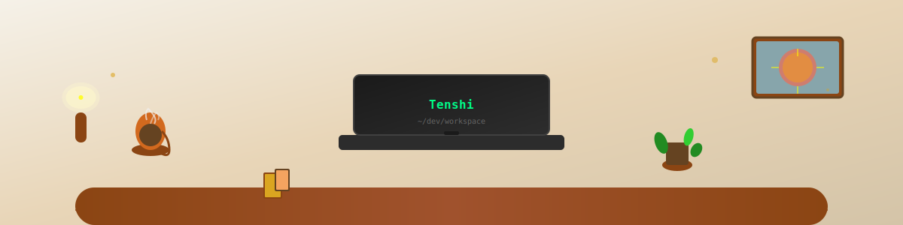

  

# 👋 Olá, eu sou Tenshiiz!

Bem-vindo ao meu perfil no GitHub! Sou um desenvolvedor apaixonado por tecnologia e sempre em busca de novos desafios e aprendizados.

## 🚀 Sobre mim

- 💻 Desenvolvedor Full Stack
- 🌱 Sempre aprendendo algo novo
- ☕ Apaixonado por café e código
- 🎨 Gosto de criar interfaces bonitas e funcionais

## 🛠️ Tecnologias que uso

  
  
  
  
  

## 📊 Estatísticas do GitHub

  
  

## 📫 Como me encontrar

  
  

---

  

*"O código é poesia executável"*

⭐️ Deixe uma estrela se gostou do meu perfil!
